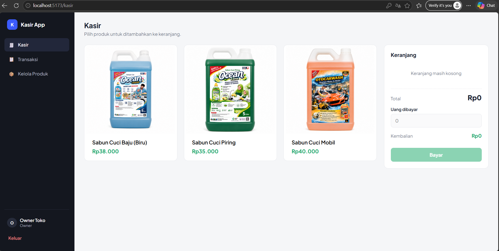
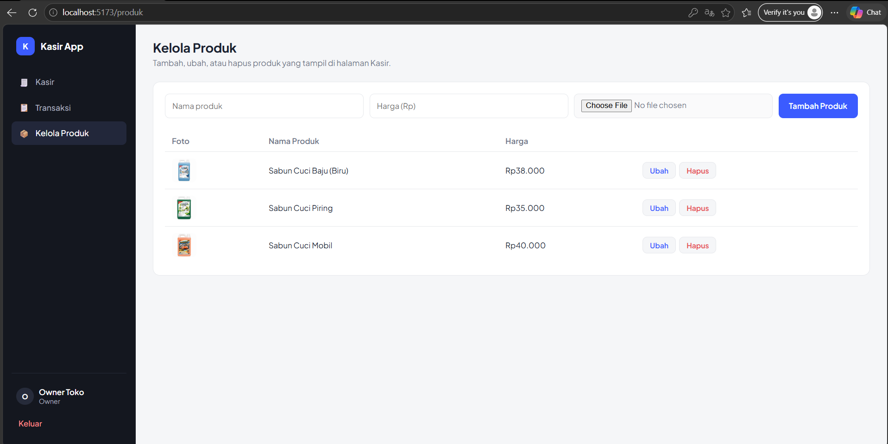
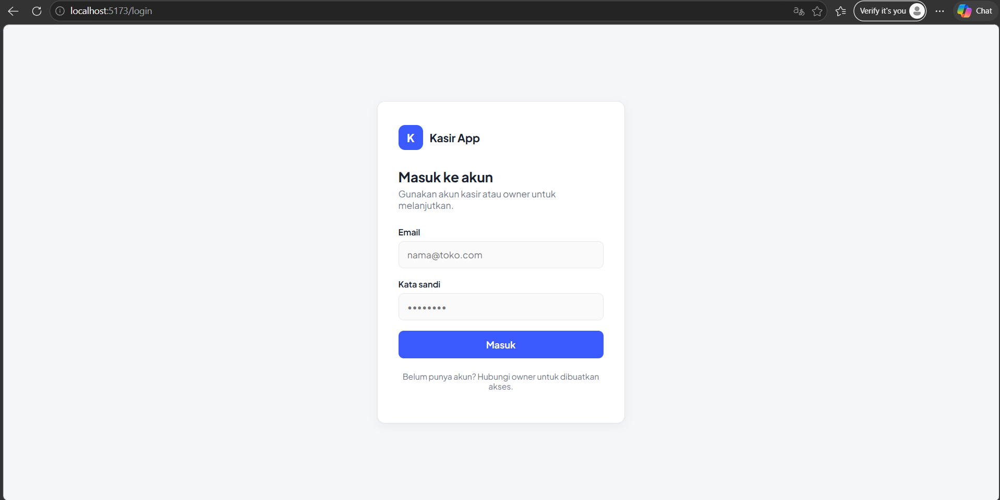
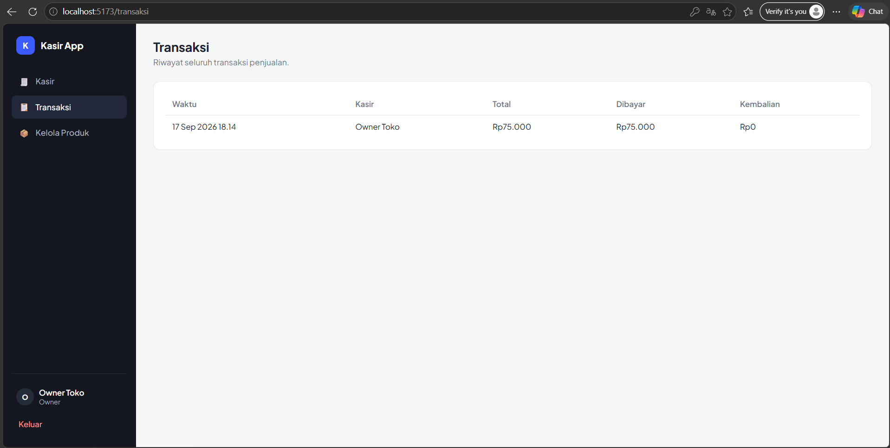

# 🧾 Kasir App — Aplikasi Point of Sale (POS) Sederhana untuk UMKM

### Aplikasi Kasir dengan 2 Role: Kasir & Owner

**Catat transaksi, kelola produk, dan batasi akses data — semuanya dari satu aplikasi ringan.**

[](https://react.dev)
[](https://vitejs.dev)
[](https://supabase.com)

---

## 📌 Tentang Aplikasi

**Kasir App** adalah aplikasi kasir (Point of Sale) sederhana yang dibangun untuk UMKM retail skala kecil — cocok untuk toko kelontong, toko sembako, atau jenis retail lain yang butuh pencatatan transaksi tanpa ribet. Dibangun sebagai proyek portofolio & tugas Uji Kompetensi **Junior Web Programmer**.

Aplikasi ini punya 2 peran login yang aksesnya berbeda: **Kasir** yang fokus mencatat transaksi harian, dan **Owner** yang punya akses tambahan untuk mengelola produk toko.

---

## ✨ Fitur Utama

- 🧾 **Kasir (POS)** — pilih produk dari grid, otomatis masuk keranjang, hitung total & kembalian secara real-time
- 📋 **Riwayat Transaksi** — semua transaksi tersimpan otomatis, bisa dilihat kasir maupun owner
- 📦 **Kelola Produk (Owner)** — tambah, ubah, dan hapus produk langsung dari UI, termasuk upload foto asli
- 🖼️ **Upload Foto Produk** — foto produk disimpan di Supabase Storage, bukan sekadar link gambar
- 🔐 **Autentikasi & Role-based Access** — login terpisah kasir/owner; menu dan hak akses dibatasi bukan cuma di tampilan, tapi juga di level database lewat **Row Level Security (RLS)**
- 📱 **Responsive** — nyaman dipakai di desktop maupun HP, sidebar otomatis jadi menu mobile di layar kecil

---

## 🖥️ Screenshot

| Halaman Kasir | Kelola Produk (Owner) |
| --- | --- |
| [](images/kasir.png) | [](images/kelola-produk.png) |

| Login | Transaksi |
| --- | --- |
| [](images/login.png) | [](images/transaksi.png) |

> 📸 Taruh screenshot kamu di folder `images/` dengan nama file di atas (`kasir.png`, `kelola-produk.png`, `login.png`, `transaksi.png`) — nanti otomatis muncul di README ini begitu di-push ke GitHub.

---

## 🛠️ Tech Stack

| Teknologi | Kegunaan |
| --- | --- |
| [React 19](https://react.dev) + [Vite](https://vitejs.dev) | Framework & build tool frontend |
| [React Router](https://reactrouter.com) | Client-side routing & route guard antar halaman |
| [Supabase](https://supabase.com) | Database PostgreSQL, autentikasi, dan penyimpanan foto (Storage) |
| CSS murni | Styling — tanpa UI framework/library tambahan |

---

## 🚀 Cara Menjalankan Lokal

### Prasyarat

- [Node.js](https://nodejs.org) versi 18 atau lebih baru
- Akun [Supabase](https://supabase.com) (gratis)

### 1. Clone Repository

```bash
git clone https://github.com/Sagasen/kasir-app.git
cd kasir-app
```

### 2. Install Dependencies

```bash
npm install
```

### 3. Setup Environment Variables

Copy file `.env.example` jadi `.env`:

```bash
cp .env.example .env
```

Lalu isi `.env` dengan kredensial Supabase-mu:

```
VITE_SUPABASE_URL=https://xxxxxxxx.supabase.co
VITE_SUPABASE_ANON_KEY=xxxxxxxxxxxxxxxx
```

> Lihat cara mendapatkan nilai ini di bagian [Setup Supabase](#️-setup-supabase) di bawah. File `.env` sudah otomatis di-ignore Git (lihat `.gitignore`), jadi kredensialmu tidak ikut ke-push ke GitHub.

### 4. Jalankan Development Server

```bash
npm run dev
```

Buka <http://localhost:5173> di browser.

---

## 🗄️ Setup Supabase

### 1. Buat Project Supabase

1. Daftar di [supabase.com](https://supabase.com)
2. Klik **New Project** → isi nama, misal `kasir-app`
3. Pilih region terdekat (misal Southeast Asia - Singapore)
4. Tunggu project siap (~2 menit)

### 2. Buat Tabel Database

1. Buka **SQL Editor → New Query**
2. Copy & paste isi file `sql/schema.sql`, klik **Run**
3. Buat query baru lagi, copy & paste isi file `sql/storage.sql`, klik **Run**
   (`storage.sql` membuat bucket khusus untuk foto produk beserta aturan aksesnya)

### 3. Buat Akun Kasir & Owner

1. Buka **Authentication → Users → Add user**, buat 2 akun (misal `kasir@toko.com` dan `owner@toko.com`)
2. Buka **SQL Editor**, jalankan (ganti UID sesuai akun yang baru dibuat):

   ```sql
   insert into public.profiles (id, name, role) values
     ('UID-AKUN-KASIR', 'Kasir Toko', 'kasir'),
     ('UID-AKUN-OWNER', 'Owner Toko', 'owner');
   ```

### 4. Ambil Kredensial

1. Buka **Project Settings → API**
2. Copy **Project URL** dan **anon public key**, masukkan ke file `.env` yang sudah kamu buat di langkah sebelumnya

---

## 🔑 Environment Variables

| Variable | Deskripsi | Wajib |
| --- | --- | --- |
| `VITE_SUPABASE_URL` | URL project Supabase | ✅ |
| `VITE_SUPABASE_ANON_KEY` | Anon/public key Supabase | ✅ |

---

## 👥 Role & Akses

| Role | Akses |
| --- | --- |
| **Kasir** | Halaman Kasir (buat transaksi), lihat riwayat Transaksi |
| **Owner** | Semua akses Kasir + Kelola Produk (tambah/ubah/hapus produk & foto) |

> 🔒 Pembatasan akses diterapkan dua lapis: disembunyikan dari sidebar (UI) **dan** ditolak di level database lewat Row Level Security (RLS) Supabase — jadi tetap aman meski diakses lewat cara lain di luar UI.

---

## 📁 Struktur Project

```
kasir-app-react/
├── src/
│   ├── components/
│   │   ├── Layout.jsx               # Sidebar + shell aplikasi
│   │   └── ProtectedRoute.jsx       # Guard: wajib login, opsional wajib role owner
│   ├── context/
│   │   ├── AuthContext.jsx          # State login & profile (role)
│   │   └── ToastContext.jsx         # Notifikasi kecil di pojok bawah
│   ├── lib/
│   │   ├── supabaseClient.js        # Konfigurasi Supabase client
│   │   ├── uploadImage.js           # Upload foto produk ke Supabase Storage
│   │   └── format.js                # Helper format Rupiah & tanggal
│   ├── pages/
│   │   ├── Login.jsx
│   │   ├── Kasir.jsx                # POS: grid produk + keranjang + bayar
│   │   ├── Transaksi.jsx            # Riwayat transaksi
│   │   └── KelolaProduk.jsx         # Tambah/ubah/hapus produk (owner only)
│   ├── App.jsx                       # Routing
│   └── index.css                     # Semua styling
├── sql/
│   ├── schema.sql                    # Skema tabel + RLS policy
│   └── storage.sql                   # Setup Supabase Storage untuk foto produk
├── .env.example                      # Contoh format environment variable
└── package.json
```

---

## 🗺️ Roadmap

- [x] Autentikasi multi-role (Kasir & Owner)
- [x] Kasir POS dengan keranjang & hitung kembalian otomatis
- [x] Riwayat transaksi
- [x] Kelola produk + upload foto ke Supabase Storage
- [x] Row Level Security (RLS) per role
- [x] Tampilan responsive (desktop & mobile)
- [ ] Cetak/export struk transaksi
- [ ] Filter riwayat transaksi berdasarkan tanggal
- [ ] Dashboard rekapitulasi & grafik penjualan
- [ ] Deploy online (Vercel/Netlify)

---

⭐ Jangan lupa beri star kalau project ini membantu!
